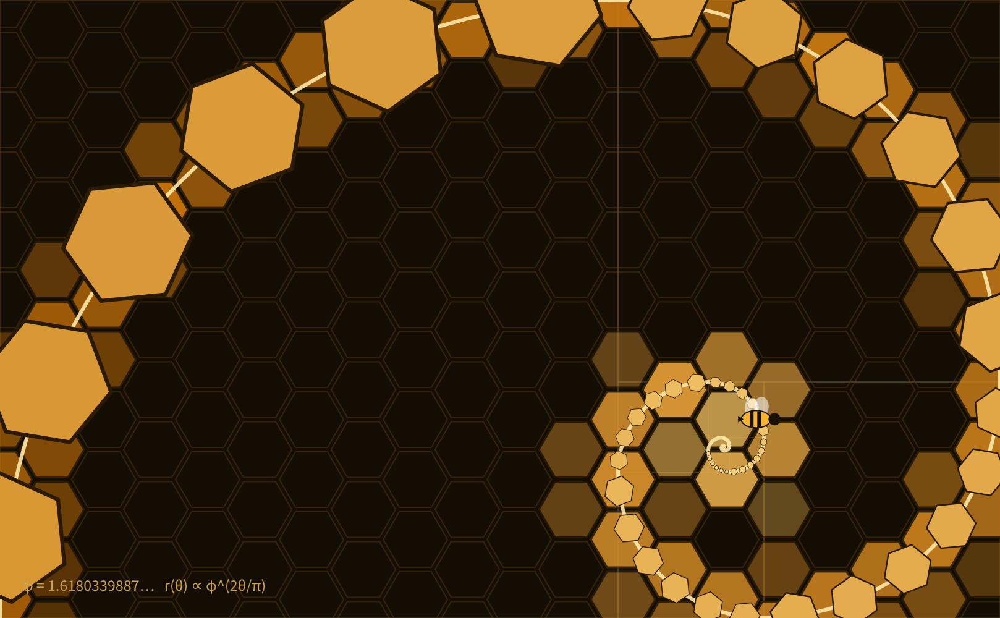

# hive-vectorcraft

VectorCraft vector editing as a host-neutral `IAddon` (`hive.vectorcraft`): an extracted command catalog, a portable request and response core, one MCP tool, a live control-channel transport to the running VectorCraft app, and a JSON C ABI over its headless engine. Calls without a transport refuse rather than simulate an edit.

The reference [VectorCraft](https://github.com/vectorcraft/vectorcraft) is a Rust Illustrator clean-room implementation (revision 65c5953). Its checkout has dual MIT/Apache-2.0 license files. This addon is MIT. [Measured surface and source pointers](docs/reference-surface.md).



## One vocabulary, several transports

| Transport | Status | Behavior |
|---|---|---|
| `SocketTransport` (JVM, `hive-vectorcraft.transport.socket`) | ships | loopback TCP, one JSON line per request, to `vectorcraft --control <port>` |
| `native/cabi` (`libvectorcraft.so`) | ships as source | Rust cdylib exporting `hive_call(op, json)` / `hive_free` over the in-process `Headless` engine; loaded by hive-native (FFM, cljrs, Node) once its loader lands |
| `ControlTransport` stub + recording decorator | test only | injected response, captured requests |
| cljs | portable core only | Node oracle |

The VectorCraft loopback control port must not be exposed to untrusted networks: upstream does not authenticate.

### Driving the running app

```sh
vectorcraft --control 7979
```

The addon builds a `SocketTransport` from `:control-port` (manifest default 7979, or the init config) or from the `VECTORCRAFT_CONTROL_PORT` environment variable. An injected `:transport` always wins. With no app listening, calls return `:vectorcraft/transport-failed` with the fix.

## MCP surface

One `vectorcraft` tool with `command` = `catalog`, `doctor`, `call` or `control`:

- `catalog`: no query returns counts and revision; query `engine`, `mcp`, `control` lists that section; any exact engine id returns its descriptor. Extracted data: **519** engine commands, **25** MCP tools and **24** control methods.
- `doctor`: catalog revision, transport present or absent, actionable hint.
- `call`: `engine_command`, `params`, `id`; checks the exact catalog id and map params before dispatch (`engine.execute`).
- `control`: `method`, `params`, `id`; any catalogued control method such as `document.inspect`, `ui.render`, `app.save`, `app.export`.

```clojure
(require '[hive-vectorcraft.addon :as vc] '[hive-addon.protocol :as addon])
(let [instance (vc/addon-ctor {:control-port 7979})
      _ (addon/initialize! instance {})
      tool (:handler (first (addon/tools instance)))]
  (tool {"command" "call" "engine_command" "file.new" "params" {"width" 600 "height" 400}})
  (tool {"command" "call" "engine_command" "shape.polygon"
         "params" {"cx" 200 "cy" 160 "radius" 50 "sides" 6 "rotation" 30}})
  (tool {"command" "control" "method" "ui.render" "params" {"path" "/tmp/out.png"}}))
```

## Layout

| File | Portable core | JVM | Native | cljs |
|---|---:|---:|---:|---:|
| `src/hive_vectorcraft/core.cljc` request, catalog lookup, frame/response values | yes | yes | source loads | yes |
| `src/hive_vectorcraft/{catalog,port,service,addon,schema,contracts}.clj` IAddon, boundary, malli contracts | no | yes | no | no |
| `src/hive_vectorcraft/transport/socket.clj` live control-channel client | no | yes | no | no |
| `resources/hive_vectorcraft/catalog.edn` pinned reference data | data | yes | data | data |
| `native/cabi/` JSON C ABI cdylib | no | no | yes | no |
| `dev/extract_catalog.clj` reproducible registry extractor | no | dev | no | no |
| `dev/portability.cljc` oracle | yes | yes | yes | yes |
| `dev/art/` work drawn live through the addon | | | | |

## Verify

Cold suite: `clojure -J-Xmx2g -M:test` (golden + property + mutation trifecta for every public function, contract completeness read off the source files, a loopback round trip against a real socket). Portability: `bash dev/verify_portability.sh jvm cljw cljrs cljs`. Native: `cargo test` in `native/cabi` (see `docs/native-cabi.md`). Catalog: `clojure -M dev/extract_catalog.clj /path/to/vectorcraft`.

## Release

`staging` is the integration branch, gated by `.github/workflows/staging-gate.yml`. A merge to `main` runs `release.yml`: tests, patch bump, changelog, tag, deploy to Clojars as `io.github.hive-agi/hive-vectorcraft` (hive-build).

## Measured here / not verified here

Measured: the control channel against a running VectorCraft build (document creation, shapes, fills, strokes, text, render and export, about 600 calls for the art above); the C ABI end to end (create, draw, save, reopen, render in 15 ms warm). Not verified here: command-parameter semantics beyond the commands exercised, the native library loaded through hive-native, a release-profile `.so` size.
