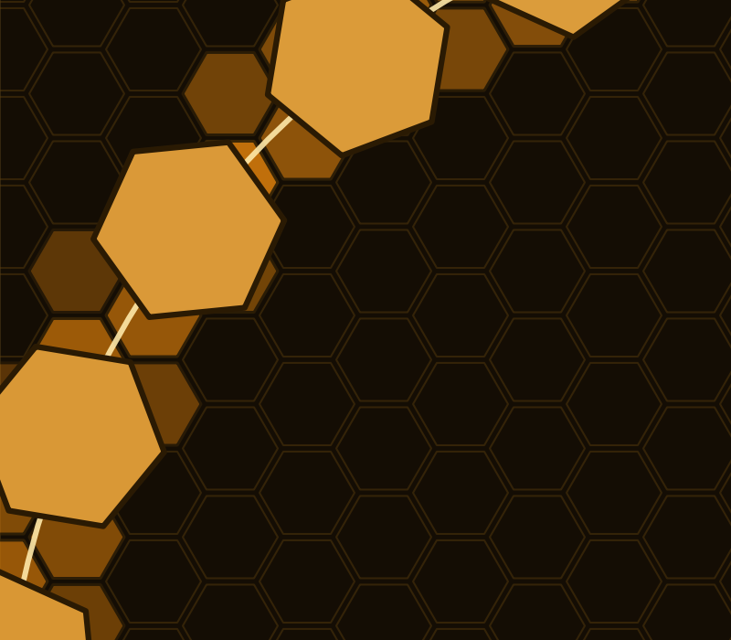
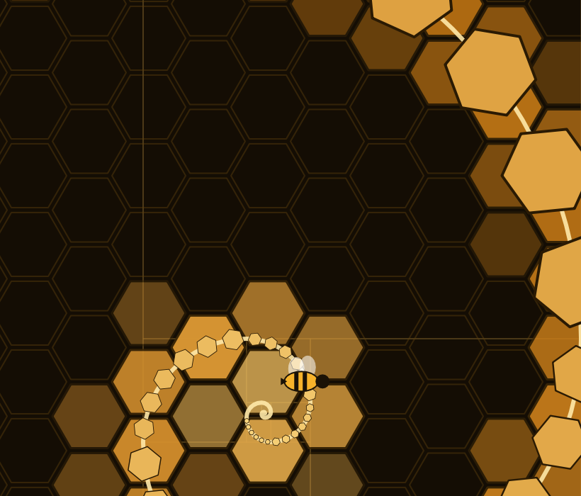
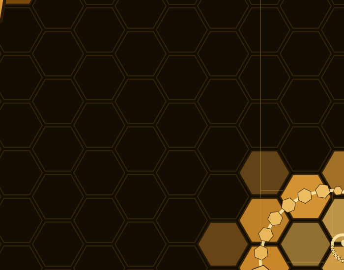

# Drawing the golden comb in VectorCraft


This image came from a live VectorCraft session controlled through hive-vectorcraft. The source document is in [`dev/art/hive-golden-comb.vectorcraft`](../../dev/art/hive-golden-comb.vectorcraft); the full render is also in [`dev/art/`](../../dev/art/). The detail images below crop the same render.

## Follow the run

1. Start VectorCraft with `vectorcraft --control 7979`. The addon opens a loopback socket to that port. Do not expose the port to untrusted networks: the upstream control protocol has no authentication.
2. Create an 809 × 500 golden-rectangle artboard with `file.new`. Build the honeycomb with `shape.polygon`, then apply `paint.setFill`, `paint.setStroke`, `stroke.set` and `transparency.set`. The run drew 240 cells lit along the spiral.
3. Use `path.create` with SVG arcs for the golden spiral. Add 48 phi-scaled hexagons and a bee at the eye. `shape.rectangle`, `shape.ellipse` and `text.create` supplied other shapes and lettering.
4. Use `ui.render` to see the result, then `app.save` and `app.export` to keep the editable document and exported art. The complete run used about 600 calls through the live control channel.

The addon exposes one tool, `vectorcraft`. `command=call` dispatches catalogued engine commands, while `command=control` dispatches catalogued control methods. For example, to render a document already open in the app:

```json
{"command":"control","method":"ui.render","params":{"path":"/tmp/vectorcraft-preview.png"}}
```

For a drawing operation, use the engine-command route:

```json
{"command":"call","engine_command":"shape.polygon","params":{"cx":200,"cy":160,"radius":50,"sides":6,"rotation":30}}
```

The port defaults to 7979 in the [manifest](../../resources/META-INF/hive-addons/hive-vectorcraft.edn). Put `"hive.vectorcraft" {:control-port 7979}` under `:addons` in hive-mcp's `config.edn`. See the [README](../../README.md#try-it) for setup. `catalog` can list engine and control names; `doctor` reports whether the transport is present. The socket client returns a transport error if the app is not listening instead of faking a result.

## Look closer



`shape.polygon`, `paint.setFill`, `paint.setStroke` and `stroke.set` built and styled the cells.



`path.create` traced the SVG arcs over the comb.



`shape.ellipse` and `text.create` completed the details; `ui.render` produced the view. These are crops, not evidence of three additional sessions.

## Alongside the other craft addons

This is one part of a cross-craft demonstration, not an automated file conversion between apps. hive-photocraft produced the separate "hive geometry" raster art. hive-vectorcraft drew this golden comb as editable vector art. In a separate 3D path, hive-blender exported a geometry slab STL and hive-bambu sliced that STL. Together they show art in photo and vector editors alongside a Blender-to-Bambu fabrication path; the golden comb was not the slicer's input.
